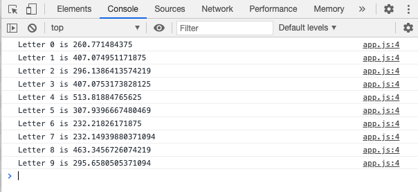

# css-logo-stroke-fill
An amazing CSS Logo Animation 🔥 . You will love using it specially if you have text logo for your project/website.

Checkout [Demo Here] (https://arifshariati.github.io/css-logo-stroke-fill/)
## Note
You can see app.js file, which literally does nothing, but is good to check out each character length of your logo so you can adjust your css property accordingly. 
to use app.js file un-comment app.js script part in index.html and also codes in app.js file. 

For this project, bellow image displays character lenght on browser console.

Cheers ! Try it out.

